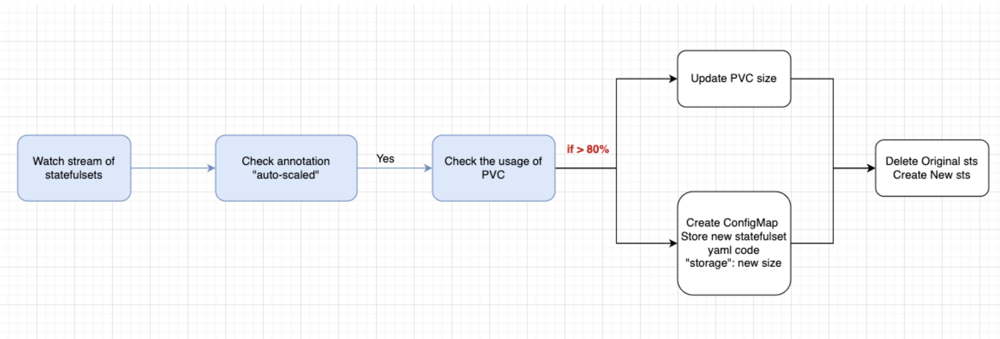

# Automated Updating PVC disk


---
This project implements an operator using the Python k8s-client to automatically update the disk storage of StatefulSet PersistentVolumeClaims (PVCs). It completely resolves the issue of being unable to modify PVC storage, and once deployed, you will never need to worry about capacity issues.


## Workflow
1. Resize Operator
   
2. Auto-Resize Operator
   


### Operator Structure
```
<Operator-name>
├── Dockerfile
├── <operator>.py
└── chart
    ├── Chart.yaml
    ├── values.yaml
    └── templates
        └── ...
```

## Setup steps

Each operator needs to build an image and deploy it to Kubernetes.

**1. [Webhook](https://github.com/pong1013/resize-statefulset-operator/tree/main/webhook)**

**2. [Manually resize](https://github.com/pong1013/resize-statefulset-operator/tree/main/main-resize-operator)**

**3. [Automatically resize](https://github.com/pong1013/resize-statefulset-operator/tree/main/auto-resize-operator)**


