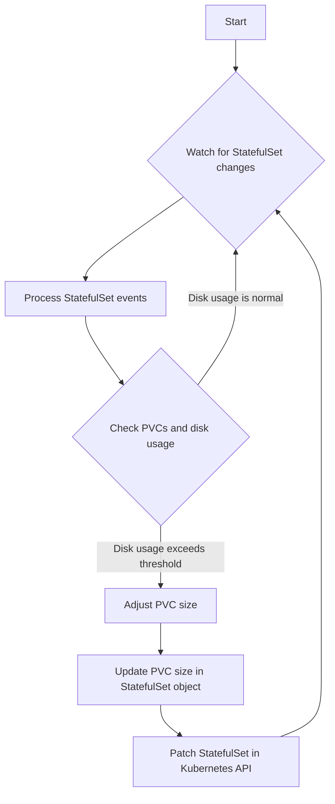

# Automatically Resize Operator

This Python script operator is designed to automatically update the size of the PersistentVolumeClaims (PVCs) associated with StatefulSets (STS) based on the disk usage within the pods.

### How to resize automatically?
Add annotation with true:

`"resize-statefulset-operator/auto-scaled": "true"`


## Setup
**1. Install Crossplane CRDs**

- To monitor and modify StatefulSets across all namespaces, we need to install Crossplane. Crossplane extends Kubernetes with Custom Resource Definitions (CRDs) and controllers, allowing us to define infrastructure resources as Kubernetes objects. 

- [Crossplane](https://marketplace.upbound.io/providers/upbound/provider-azure/v0.19.0/docs)


**2. Add local config**

- Using a local kubeconfig allows you to execute `auto.py` locally to test if the operator is running smoothly. Once you've confirmed there are no issues, you can then build the image and deploy it to Kubernetes.
  ```python
  # local load kubeconfig
  config.load_kube_config("PATH TO KUBECONFIG")
  ```

**3. Build Image**

- You can use `Docker` or `Azure Pipeline` to build image

**4. Deploy to k8s**

- `helm install auto-resize ./`


## Workflow

