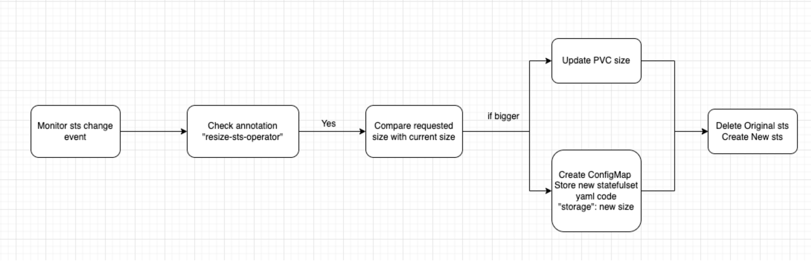

# Manually Resize Operator
This Python script operator monitors StatefulSets across all namespaces in a Kubernetes cluster and adjusts the size of their PersistentVolumeClaims (PVCs) based on annotations provided in the StatefulSet metadata.

### How to resize manually?
Add annotation with new size:
- `"resize-statefulset-operator/resize-{vc}": "10Gi"` -> `"resize-statefulset-operator/resize-0": "10Gi"`
- ‼️Statefulset may has several vc template, so we need to specify the no. of vc.

## Setup
**1. Install Crossplane CRDs**

- To monitor and modify StatefulSets across all namespaces, we need to install Crossplane. Crossplane extends Kubernetes with Custom Resource Definitions (CRDs) and controllers, allowing us to define infrastructure resources as Kubernetes objects. 

- [Crossplane](https://marketplace.upbound.io/providers/upbound/provider-azure/v0.19.0/docs)

**2. Add local config**

- Using a local kubeconfig allows you to execute `resize-sts-operator.py` locally to test if the operator is running smoothly. Once you've confirmed there are no issues, you can then build the image and deploy it to Kubernetes.
  ```python
  # local load kubeconfig
  config.load_kube_config("PATH TO KUBECONFIG")
  ```

**3. Build Image**

- `docker build`

**4. Deploy to k8s**

- `helm install resize-statefulset-operator ./`


