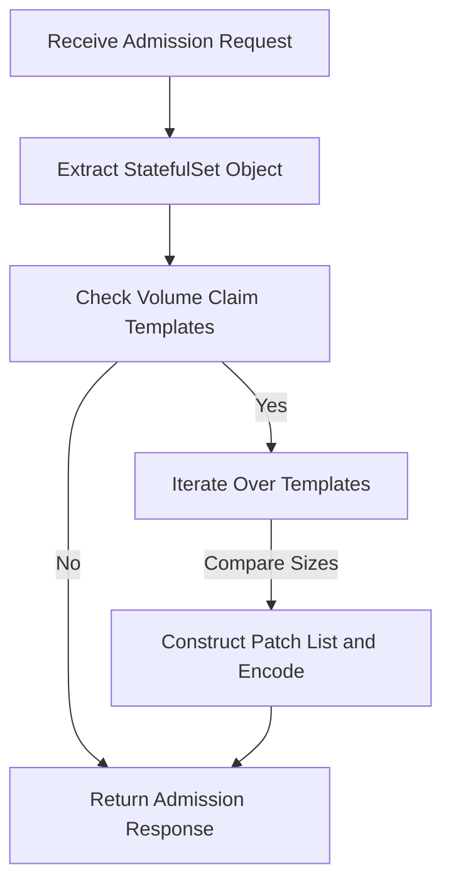

# Webhook Operator
This webhook server defines a Flask web application that acts as an admission controller for Kubernetes. The admission controller intercepts requests to create or update StatefulSet objects in Kubernetes and modifies them based on predefined logic.

If you want to become familiar with k8s webhook. I recommand this page by [Kristijan Mitevsk](https://kmitevski.com/kubernetes-mutating-webhook-with-python-and-fastapi/)


## Setup Webhook
**1. Generate SAN Cert**

- Generate your own SAN cert in `./cert` folder.([here](https://github.com/pong1013/resize-statefulset-operator/tree/main/webhook/cert))

**2. Add local config**

- Using a local kubeconfig allows you to execute `webhook.py` locally to test if the operator is running smoothly. Once you've confirmed there are no issues, you can then build the image and deploy it to Kubernetes.
  ```python
  # local load kubeconfig
  config.load_kube_config("PATH TO KUBECONFIG")
  ```

**3. Build Image**

- `docker build`

**4. Deploy to k8s**

- `helm install webhook ./`


## Workflow

